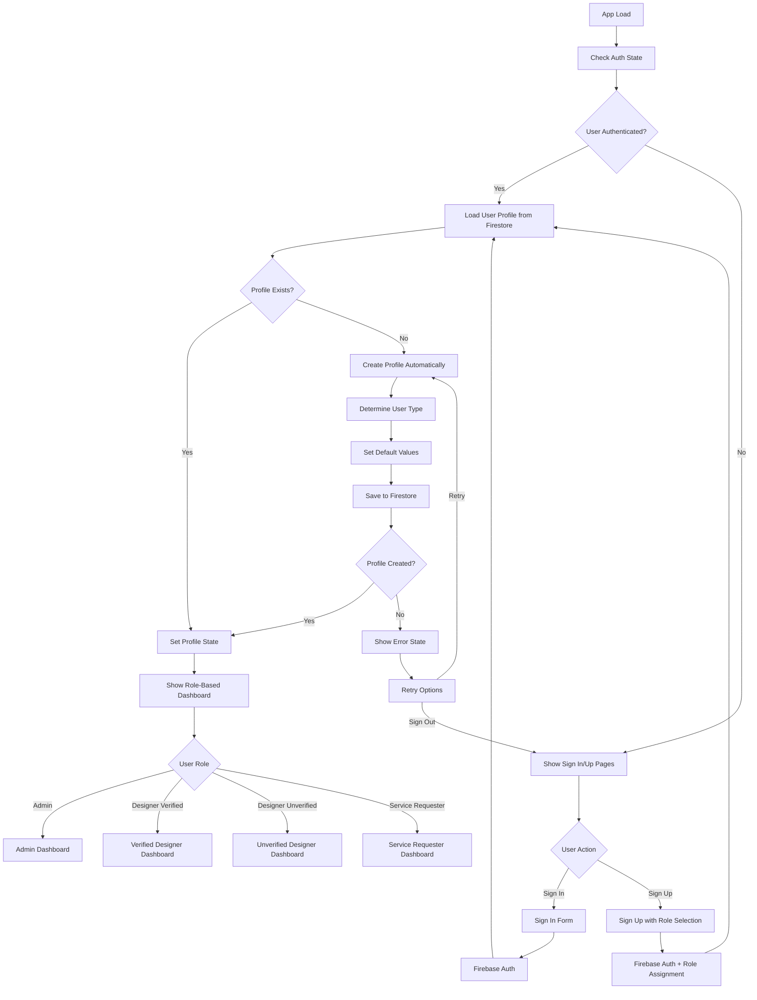
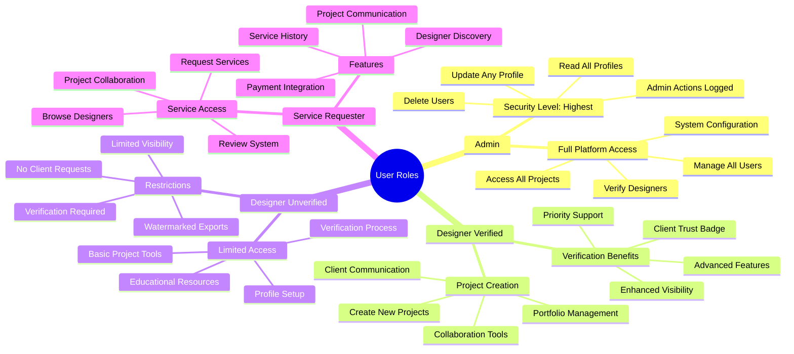
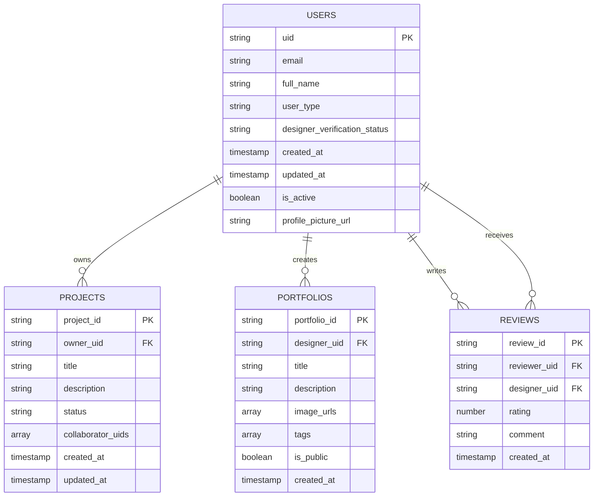
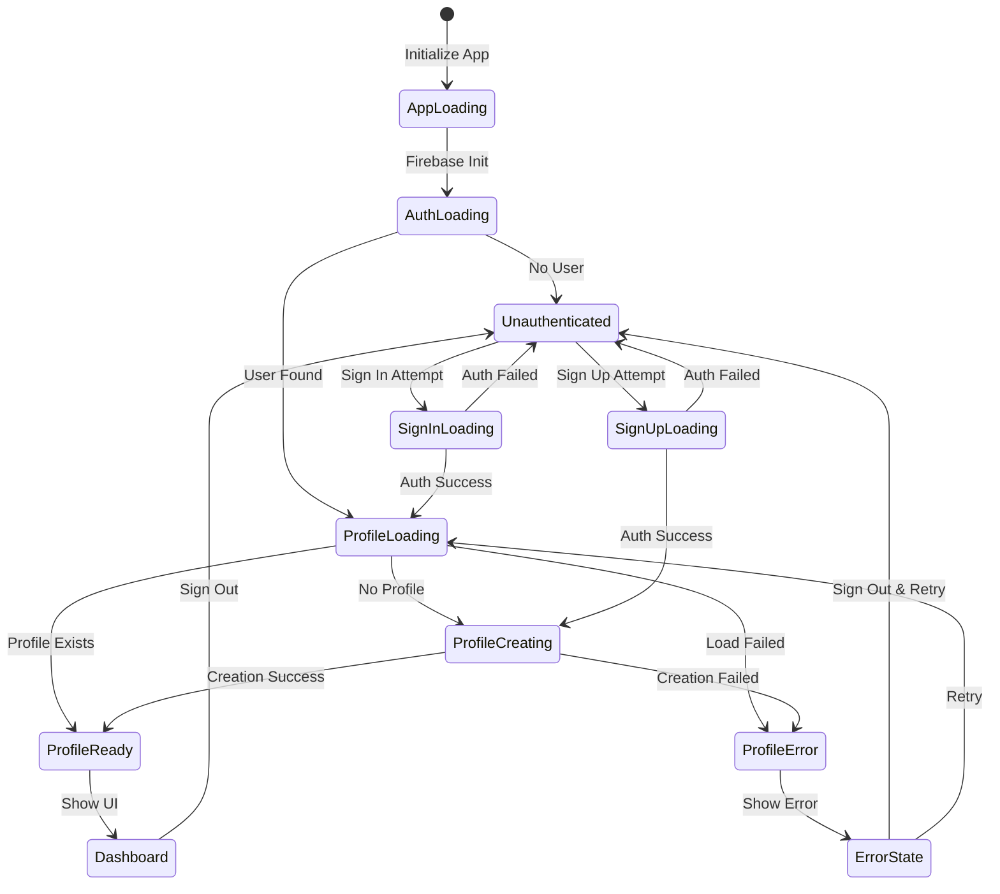
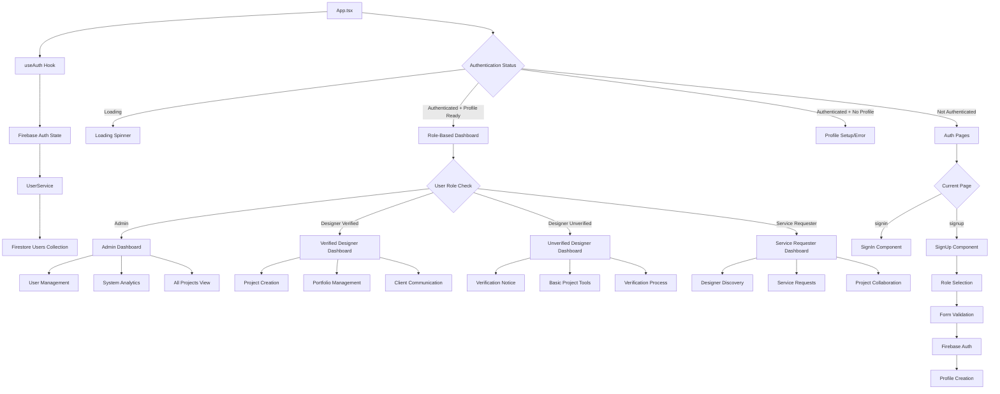
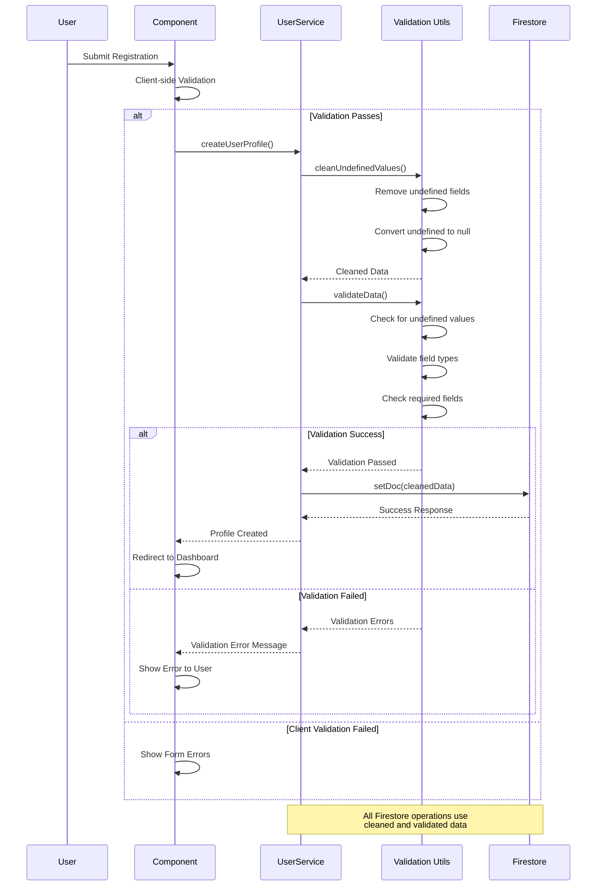
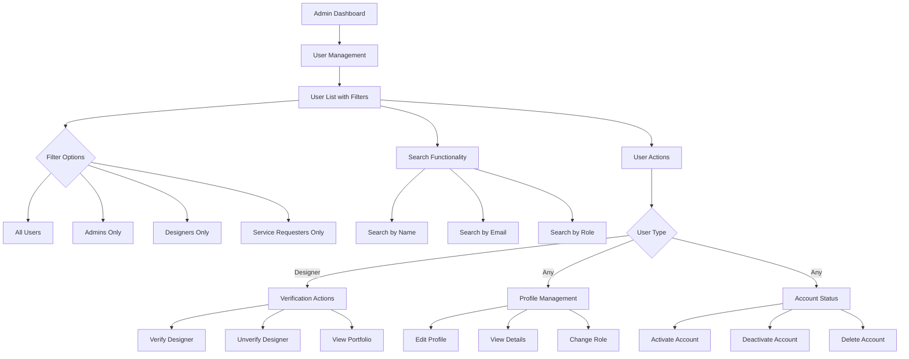
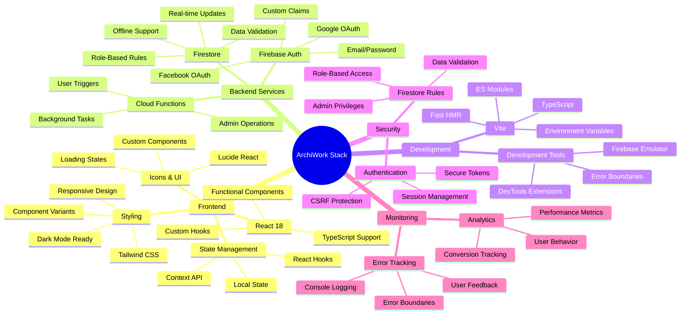
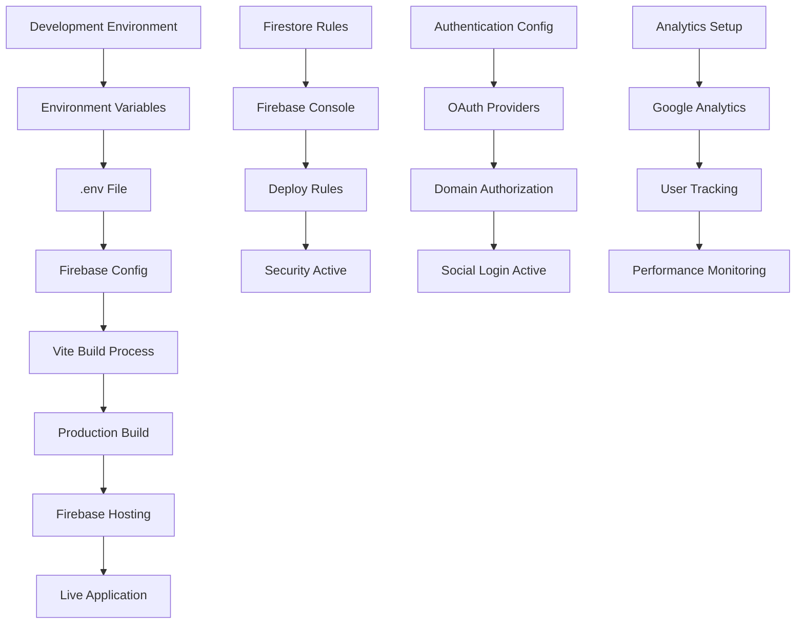
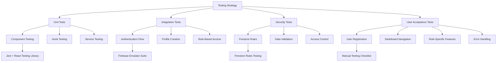

# ArchiWork - Project Diagrams & Architecture Documentation

This document contains comprehensive visual diagrams documenting the ArchiWork application architecture, user flows, component structure, and role-based authentication system.

## 1. Updated Project Structure

```
ArchiWork/
├── src/
│   ├── components/
│   │   ├── SignIn.tsx
│   │   ├── SignUp.tsx
│   │   ├── Dashboard.tsx
│   │   ├── UserManagement.tsx
│   │   └── AuthWrapper.tsx
│   ├── hooks/
│   │   ├── useAuth.ts
│   │   └── useAuthWithAutoProfile.ts
│   ├── services/
│   │   ├── userService.ts
│   │   └── autoProfileService.ts
│   ├── types/
│   │   └── user.ts
│   ├── utils/
│   │   ├── firestoreHelpers.ts
│   │   └── firestoreValidation.ts
│   ├── config/
│   │   └── firebase.ts
│   ├── App.tsx
│   ├── main.tsx
│   └── index.css
├── firestore.rules
├── FIRESTORE_ERROR_DEBUGGING.md
├── ROLE_IMPLEMENTATION_GUIDE.md
├── INTEGRATION_GUIDE.md
└── DIAGRAMS.md
```

## 2. Enhanced Role-Based Authentication Flow



## 3. Role-Based User Types & Permissions



## 4. Firestore Data Structure & Security



## 5. Enhanced Authentication State Management



## 6. Component Architecture with Role-Based Access



## 7. Firestore Security Rules Flow

```mermaid
flowchart TD
    A[Firestore Request] --> B{User Authenticated?}
    B -->|No| C[Deny Access]
    B -->|Yes| D[Get User Type from Document]
    
    D --> E{Operation Type}
    E -->|Read| F{Read Rules Check}
    E -->|Write| G{Write Rules Check}
    E -->|Delete| H{Delete Rules Check}
    
    F --> I{Resource Type}
    I -->|Own Profile| J[Allow]
    I -->|Other Profile| K{User Role}
    K -->|Admin| J
    K -->|Designer Verified| L{Target is Designer?}
    K -->|Service Requester| M{Target is Verified Designer?}
    L -->|Yes| J
    L -->|No| C
    M -->|Yes| J
    M -->|No| C
    K -->|Other| C
    
    G --> N{Resource Type}
    N -->|Own Profile| O{Field Updates}
    N -->|Other Profile| P{Admin Only}
    O -->|Basic Fields| J
    O -->|Role/Verification| Q{Admin Only}
    P -->|Yes (Admin)| J
    P -->|No| C
    Q -->|Yes (Admin)| J
    Q -->|No| C
    
    H --> R{Admin Only}
    R -->|Yes| J
    R -->|No| C
```

## 8. Error Handling & Data Validation Flow



## 9. User Management Admin Interface



## 10. Profile Creation & Auto-Management System

```mermaid
flowchart TD
    A[User Authentication Event] --> B[AutoProfileService.handleUserProfileCreation()]
    
    B --> C{User Null?}
    C -->|Yes| D[Return False]
    C -->|No| E{Already Processing?}
    
    E -->|Yes| F[Return True - Avoid Duplicates]
    E -->|No| G[Add to Processing Set]
    
    G --> H[Check Profile Exists - Cache First]
    H --> I{Profile Exists?}
    I -->|Yes| J[Update Cache & Return True]
    I -->|No| K[Create Profile]
    
    K --> L[Determine User Type]
    L --> M[Set Verification Status]
    M --> N[Clean Undefined Values]
    N --> O[Validate Data]
    O --> P{Validation Passed?}
    
    P -->|No| Q[Log Error & Return False]
    P -->|Yes| R[Save to Firestore]
    
    R --> S{Save Successful?}
    S -->|Yes| T[Update Cache]
    S -->|No| U[Log Error]
    
    T --> V[Remove from Processing Set]
    U --> V
    Q --> V
    J --> V
    
    V --> W[Return Result]
```

## 11. Technology Stack & Integration Points



## 12. Implementation Status & Feature Matrix

| Feature Category | Admin | Designer Verified | Designer Unverified | Service Requester | Status |
|------------------|-------|-------------------|---------------------|-------------------|--------|
| **Authentication** |
| Email/Password | ✅ | ✅ | ✅ | ✅ | Complete |
| Google OAuth | ✅ | ✅ | ✅ | ✅ | Complete |
| Facebook OAuth | ✅ | ✅ | ✅ | ✅ | Complete |
| Auto Profile Creation | ✅ | ✅ | ✅ | ✅ | Complete |
| **User Management** |
| View All Users | ✅ | ❌ | ❌ | ❌ | Complete |
| Manage Roles | ✅ | ❌ | ❌ | ❌ | Complete |
| Verify Designers | ✅ | ❌ | ❌ | ❌ | Complete |
| User Analytics | ✅ | ❌ | ❌ | ❌ | Complete |
| **Project Management** |
| Create Projects | ✅ | ✅ | 🔒 Limited | ❌ | In Progress |
| View All Projects | ✅ | Own Only | Own Only | Collaborated | In Progress |
| Collaborate | ✅ | ✅ | ✅ | ✅ | Planned |
| **Portfolio** |
| Create Portfolio | ✅ | ✅ | 🔒 Limited | ❌ | Planned |
| Public Visibility | ✅ | ✅ | ❌ | N/A | Planned |
| **Service Requests** |
| Browse Designers | ✅ | ✅ | ✅ | ✅ | Planned |
| Request Services | ✅ | ❌ | ❌ | ✅ | Planned |
| **Security & Access** |
| Role-Based Dashboard | ✅ | ✅ | ✅ | ✅ | Complete |
| Firestore Rules | ✅ | ✅ | ✅ | ✅ | Complete |
| Data Validation | ✅ | ✅ | ✅ | ✅ | Complete |
| Error Handling | ✅ | ✅ | ✅ | ✅ | Complete |

Legend: ✅ Full Access | 🔒 Limited Access | ❌ No Access | N/A Not Applicable

## 13. Deployment & Environment Configuration



## 14. Testing Strategy & Quality Assurance



---

## 📊 **Current Architecture Summary**

The ArchiWork application now features a **comprehensive role-based authentication system** with automatic Firestore profile management, enhanced error handling, and production-ready security measures.

### **Key Achievements:**
- ✅ **4-tier role system** (Admin, Designer Verified/Unverified, Service Requester)
- ✅ **Automatic profile creation** with intelligent user type assignment
- ✅ **Comprehensive error handling** with user-friendly messages
- ✅ **Production-ready security rules** with role-based access control
- ✅ **Type-safe TypeScript** implementation throughout
- ✅ **Responsive UI** with role-specific dashboards

### **Next Development Phase:**
- 🔄 **Project management system** with role-based permissions
- 🔄 **Designer portfolio system** with public visibility controls
- 🔄 **Service request marketplace** connecting requesters with designers
- 🔄 **Real-time messaging** system for collaboration
- 🔄 **Payment integration** for service transactions

*Last Updated: January 2025*  
*ArchiWork - Production-Ready Role-Based Architecture*